Realtime fMRI App Guide
=======================

This guide will explain how to operate the webapp for realtime fMRI for the mTBI project. For more information on the operators script, see here_.

.. _here: https://docs.google.com/document/d/1USIrkchqg4suDf5jHPyEL7cXdqiow04-TORJLQv7XGM/edit?usp=sharing

Starting the App
----------------

First click the Terminal icon on the side bar.

.. image:: images/terminal_icon.png
   :scale: 50%

type "start" in the terminal window.

>>> start

Then open the google chrome browser, and click the Realtime fMRI bookmark at the top. You should see the login screen

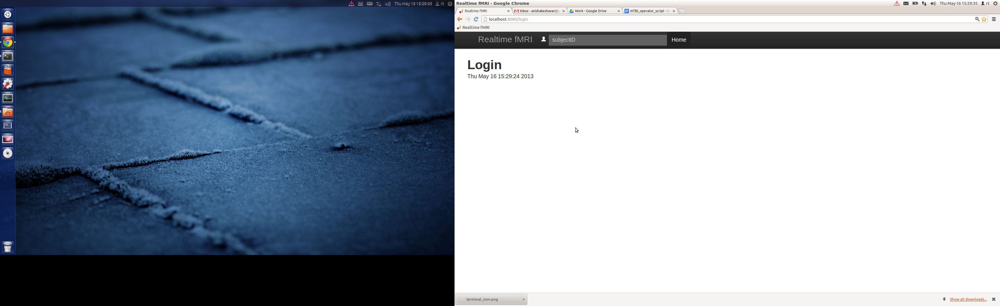

Type in the subject id at the top field and press enter

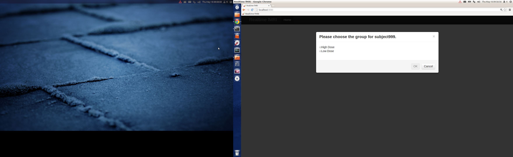

Choose the dose for the participant. Remember that this should be the dose you chose when you trained the subject.

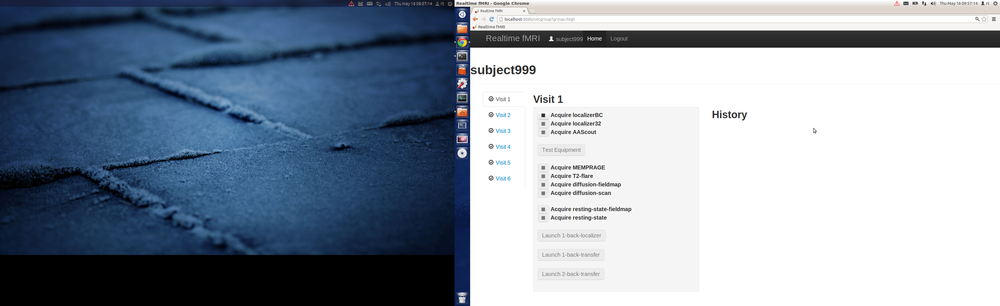

Click each checkbox and start the corresponding scan sequence. Test that the equipment is set up propery after the two localizers and the AAScout

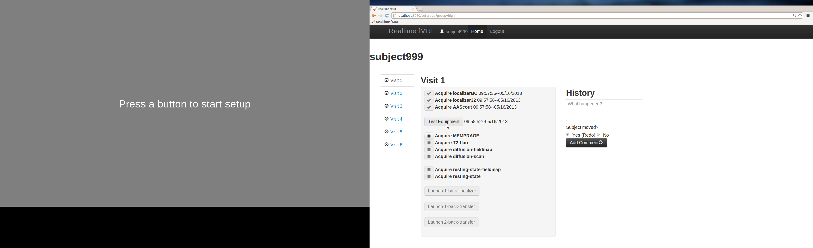

Ask the subject to press their button to start setup. Adjust the volume until the subject indicates that the volume is good. Ask them to press the number 2 button to continue.

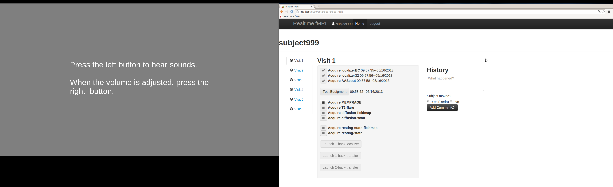

After the 2 button is pressed, the scanner trigger needs to be tested. Start the short scan sequence and make sure the software registers the trigger.

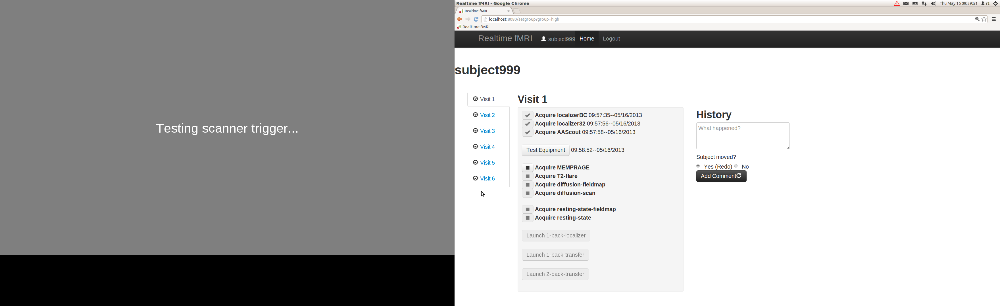

You can comment at the History section on the left side of the screen. If the subject left the scanner, then click the "Yes (redo)" radio button. If they did not move, click "no". If the subject was moved, then the localizers and AA xscout must be re acquired. 

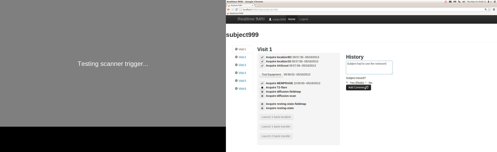

The localizers and AAscout buttons will activate once again. After re-running the sequences, the protocol will start back where you left off.

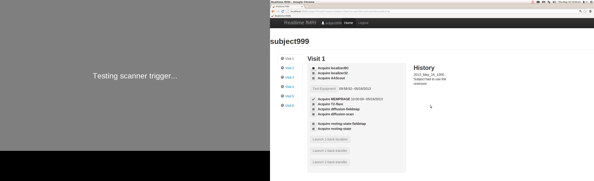

The subject will do 3 fMRI tasks, 1 localizer and 2 transfers:

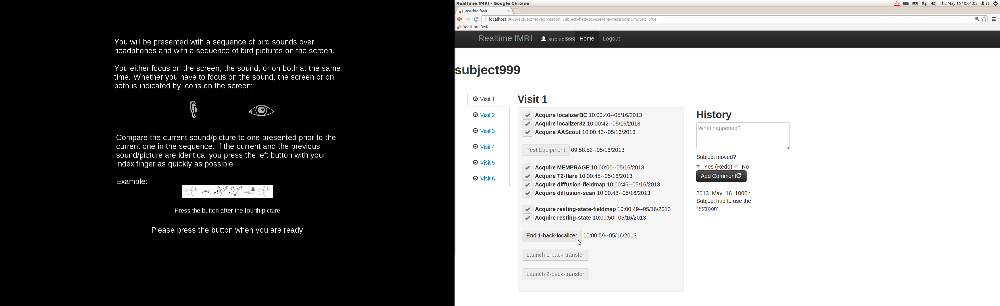

Ask the subject to press the 1 button after they read and understand the instructions. Then start the fMRI sequence.

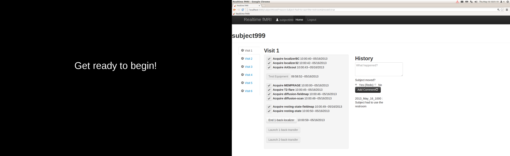

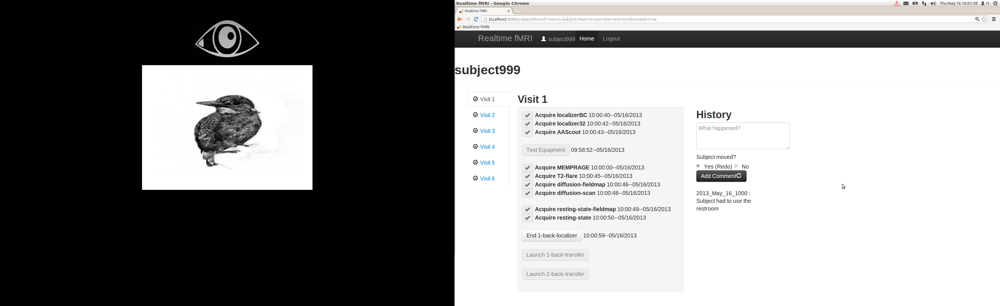

After the scan finishes, click the "End localizer" button

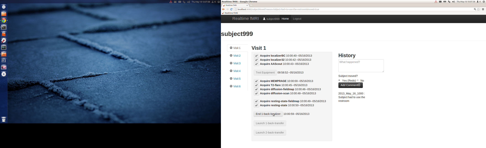

Then start the transfer tasks:

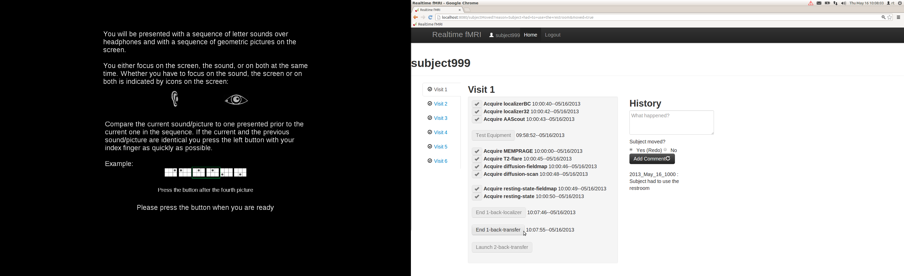

Again, wait for the subject to press the 1 button before starting the scan.

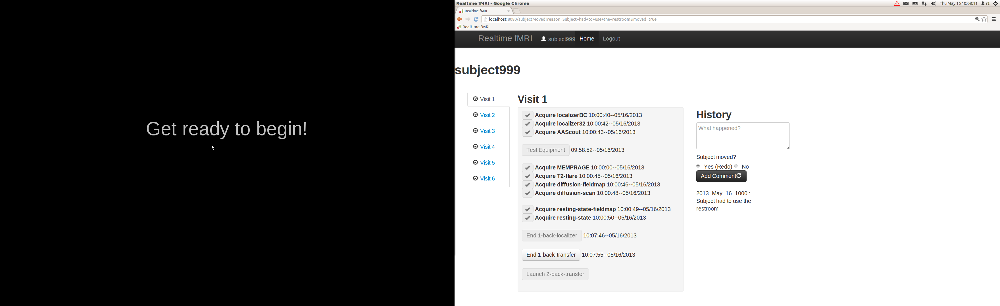

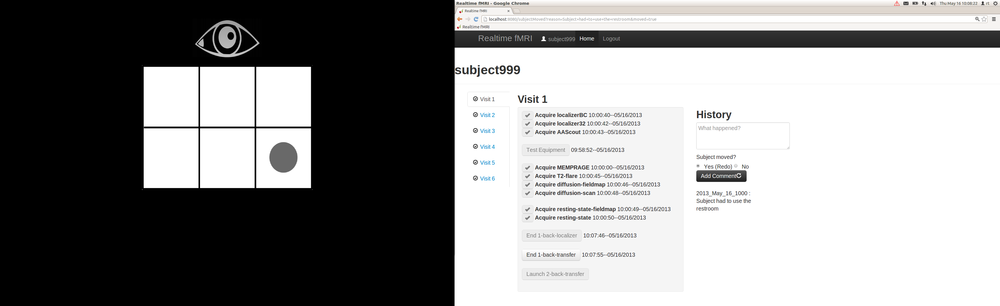

When all the runs are complete, the checkmark on the side for visit one changes:

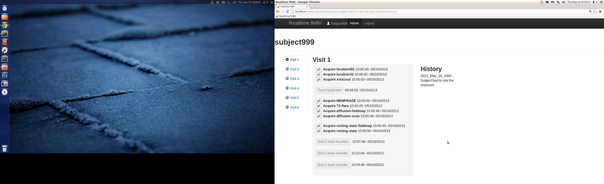

When you have internet access, transfer data to MIT for the subject, by first typing in the terminal:

>>> transfer

And then choosing the subject ID, "transfer data to MIT" and the session:

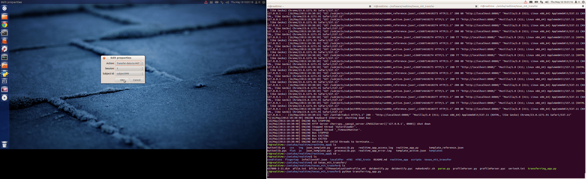

Also transfer DVD data to MIT:

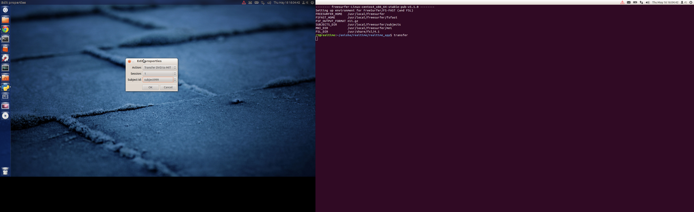

Click OK to start transfer.

Before starting a subject's second visit, you need to grab data from MIT. If you don't, you will see a message in history:

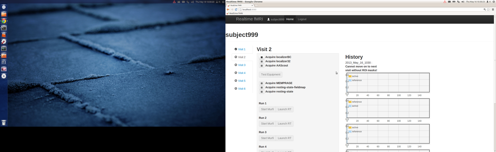

To fetch data from MIT, in the terminal type:

>>> transfer

Click "fetch data from MIT", and the subject id. Make sure you have internet connection.

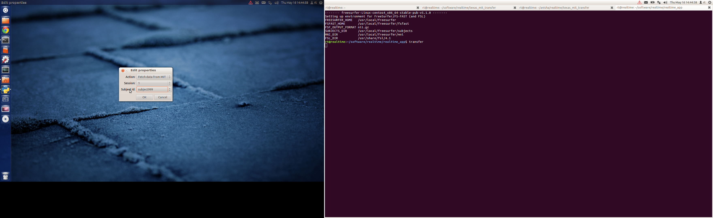

Run the localizer sequences, test setup, run the MPRAGE and resting state scans. For the first realtime run, first click "Start Murfi" followed by "Launch RT"

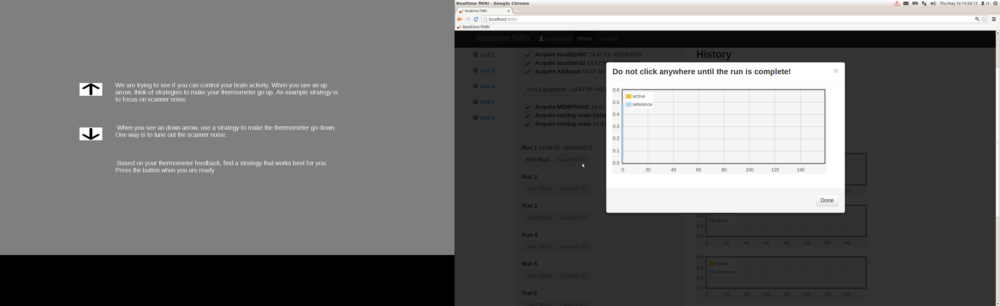

Follow the instructions: Do not click anywhere until the run is complete. Ask the subject to press the 1 button, showing that they understand what to do, and then start the fMRI scan. The plot on the browser side will update as data comes in realtime.

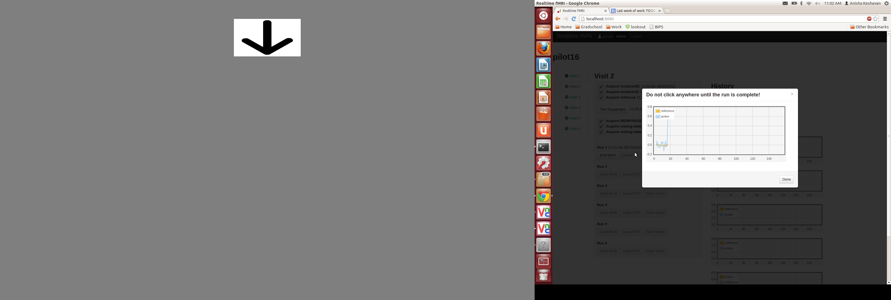

When the run completes, the subject will see how they did:

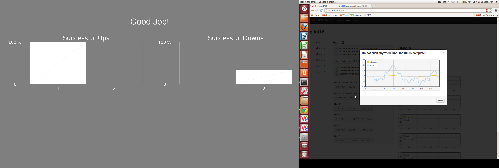

After all runs are complete, always remember to transfer data and transfer DVD data to MIT from the CD.

